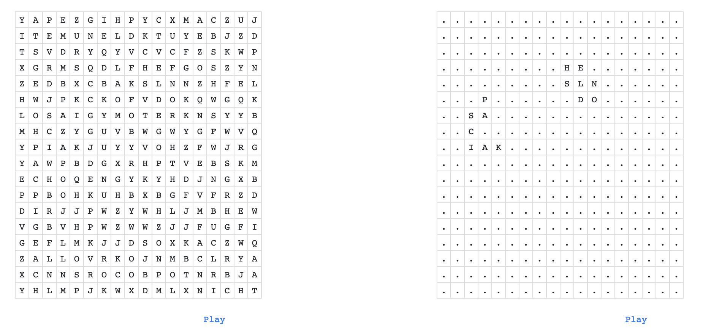
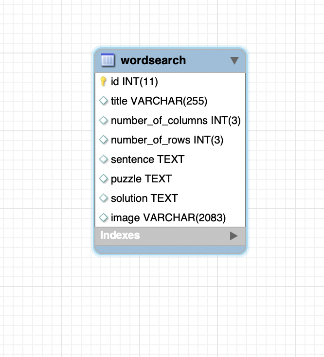
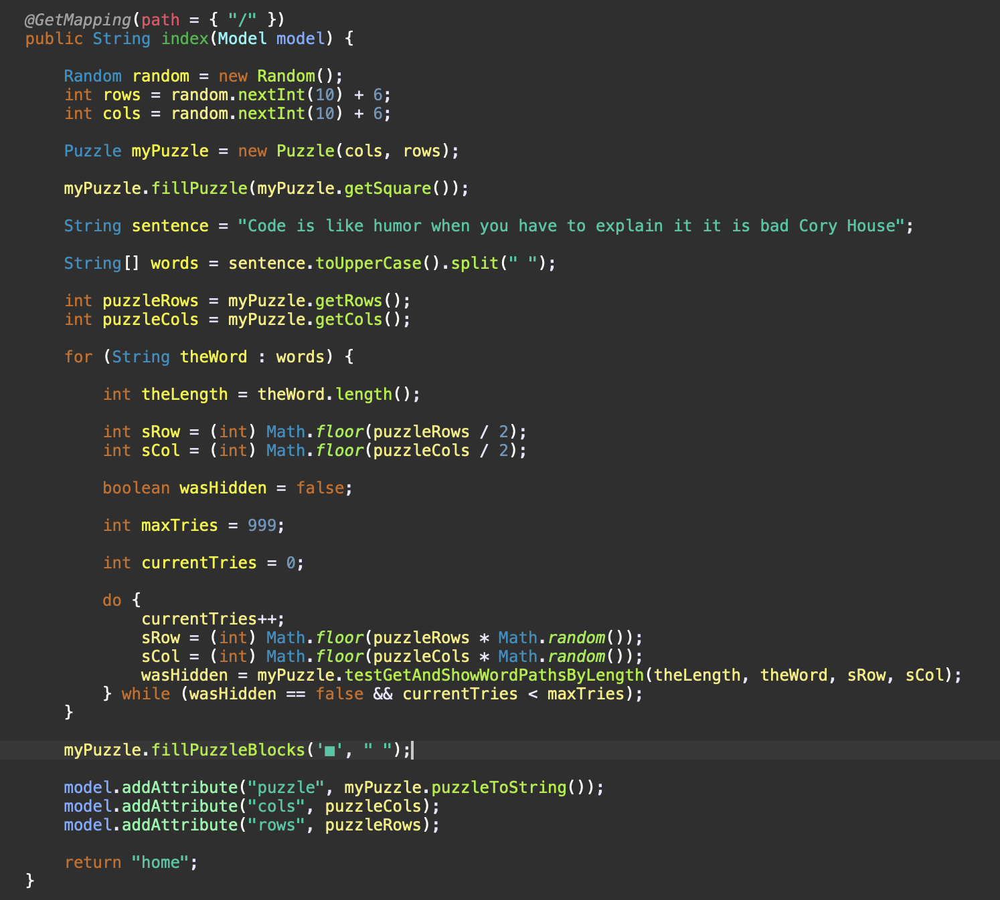

# JPACRUDProject

#### Description

- This is a full stack Spring Boot Project that implements the ability to Create, Read, Update and Delete records stored in a MySQL Database.

#### Technologies Used

    - JAVA
    - Eclipse
    - Git/GitHub
    - MySQL
    - Sublime Text Editor
    - Zsh
    - JPA
    - Spring Boot
    - HTML/CSS/JavaScript

#### Lessons Learned

    - Attention to detail, read and re-read requirements.
    - Make it work, then make it look good.
    - Focus on the requirements, then stretch the goals!
    - Be careful not to mix up cols/rows on edit!

#### Structure

```


JPACrudProject
├── 1.png
├── 2.png
├── 3.png
├── BootPuzzles
│   ├── HELP.md
│   ├── bin
│   │   ├── main
│   │   │   ├── application.properties
│   │   │   ├── com
│   │   │   │   └── skilldistillery
│   │   │   │       └── puzzle
│   │   │   │           ├── BootPuzzlesApplication.class
│   │   │   │           ├── ServletInitializer.class
│   │   │   │           ├── controllers
│   │   │   │           │   └── WordsearchController.class
│   │   │   │           ├── data
│   │   │   │           │   ├── WordsearchDAO.class
│   │   │   │           │   └── WordsearchDAOJpaImpl.class
│   │   │   │           └── util
│   │   │   │               ├── Point.class
│   │   │   │               ├── Puzzle$MyRowColClass.class
│   │   │   │               ├── Puzzle.class
│   │   │   │               ├── PuzzleMatrix.class
│   │   │   │               └── PuzzlePiece.class
│   │   │   └── templates
│   │   └── test
│   │       └── com
│   │           └── skilldistillery
│   │               └── puzzle
│   │                   └── BootPuzzlesApplicationTests.class
│   ├── build.gradle
│   ├── gradle
│   │   └── wrapper
│   │       ├── gradle-wrapper.jar
│   │       └── gradle-wrapper.properties
│   ├── gradlew
│   ├── gradlew.bat
│   ├── settings.gradle
│   └── src
│       ├── main
│       │   ├── java
│       │   │   └── com
│       │   │       └── skilldistillery
│       │   │           └── puzzle
│       │   │               ├── BootPuzzlesApplication.java
│       │   │               ├── ServletInitializer.java
│       │   │               ├── controllers
│       │   │               │   └── WordsearchController.java
│       │   │               ├── data
│       │   │               │   ├── WordsearchDAO.java
│       │   │               │   └── WordsearchDAOJpaImpl.java
│       │   │               └── util
│       │   │                   ├── Point.java
│       │   │                   ├── Puzzle.java
│       │   │                   ├── PuzzleMatrix.java
│       │   │                   └── PuzzlePiece.java
│       │   ├── resources
│       │   │   ├── application.properties
│       │   │   ├── static
│       │   │   └── templates
│       │   └── webapp
│       │       ├── WEB-INF
│       │       │   ├── _head.jsp
│       │       │   ├── _nav.jsp
│       │       │   ├── _tail.jsp
│       │       │   ├── error.jsp
│       │       │   ├── home.jsp
│       │       │   ├── success.jsp
│       │       │   └── wordsearch
│       │       │       └── show.jsp
│       │       ├── favicon.png
│       │       ├── index.html
│       │       └── uploads
│       └── test
│           └── java
│               └── com
│                   └── skilldistillery
│                       └── puzzle
│                           └── BootPuzzlesApplicationTests.java
├── DB
│   ├── Puzzle.mwb
│   ├── Puzzle.sql
│   └── Puzzle.txt
├── JPAPuzzles
│   ├── bin
│   │   ├── main
│   │   │   ├── META-INF
│   │   │   │   └── persistence.xml
│   │   │   ├── com
│   │   │   │   └── skilldistillery
│   │   │   │       └── puzzle
│   │   │   │           └── entities
│   │   │   │               └── Wordsearch.class
│   │   │   └── log4j2.properties
│   │   └── test
│   │       ├── com
│   │       │   └── skilldistillery
│   │       │       └── puzzle
│   │       │           └── entities
│   │       │               └── WordsearchTest.class
│   │       └── log4j2.properties
│   ├── build
│   │   ├── classes
│   │   │   ├── META-INF
│   │   │   │   └── persistence.xml
│   │   │   └── java
│   │   │       ├── main
│   │   │       │   └── com
│   │   │       │       └── skilldistillery
│   │   │       │           └── puzzle
│   │   │       │               └── entities
│   │   │       │                   └── Wordsearch.class
│   │   │       └── test
│   │   │           └── com
│   │   │               └── skilldistillery
│   │   │                   └── puzzle
│   │   │                       └── entities
│   │   │                           └── WordsearchTest.class
│   │   ├── generated
│   │   │   └── sources
│   │   │       ├── annotationProcessor
│   │   │       │   └── java
│   │   │       │       ├── main
│   │   │       │       └── test
│   │   │       └── headers
│   │   │           └── java
│   │   │               ├── main
│   │   │               └── test
│   │   ├── reports
│   │   │   └── tests
│   │   │       └── test
│   │   │           ├── classes
│   │   │           │   └── com.skilldistillery.puzzle.entities.WordsearchTest.html
│   │   │           ├── css
│   │   │           │   ├── base-style.css
│   │   │           │   └── style.css
│   │   │           ├── index.html
│   │   │           ├── js
│   │   │           │   └── report.js
│   │   │           └── packages
│   │   │               └── com.skilldistillery.puzzle.entities.html
│   │   ├── resources
│   │   │   ├── main
│   │   │   │   ├── META-INF
│   │   │   │   │   └── persistence.xml
│   │   │   │   └── log4j2.properties
│   │   │   └── test
│   │   │       └── log4j2.properties
│   │   ├── test-results
│   │   │   └── test
│   │   │       ├── TEST-com.skilldistillery.puzzle.entities.WordsearchTest.xml
│   │   │       └── binary
│   │   │           ├── output.bin
│   │   │           ├── output.bin.idx
│   │   │           └── results.bin
│   │   └── tmp
│   │       ├── compileJava
│   │       │   └── previous-compilation-data.bin
│   │       ├── compileTestJava
│   │       │   ├── compileTransaction
│   │       │   │   ├── backup-dir
│   │       │   │   └── stash-dir
│   │       │   │       └── WordsearchTest.class.uniqueId0
│   │       │   └── previous-compilation-data.bin
│   │       └── test
│   ├── build.gradle
│   ├── gradle
│   │   ├── libs.versions.toml
│   │   └── wrapper
│   │       ├── gradle-wrapper.jar
│   │       └── gradle-wrapper.properties
│   ├── gradlew
│   ├── gradlew.bat
│   ├── settings.gradle
│   └── src
│       ├── main
│       │   ├── java
│       │   │   └── com
│       │   │       └── skilldistillery
│       │   │           └── puzzle
│       │   │               └── entities
│       │   │                   └── Wordsearch.java
│       │   └── resources
│       │       ├── META-INF
│       │       │   └── persistence.xml
│       │       └── log4j2.properties
│       └── test
│           ├── java
│           │   └── com
│           │       └── skilldistillery
│           │           └── puzzle
│           │               └── entities
│           │                   └── WordsearchTest.java
│           └── resources
│               └── log4j2.properties
└── README.md

115 directories, 82 files

```

<hr>

### The welcome page dynamically creates and renders a puzzle.



<hr>

### The database consists of only 1 single table.



<hr>

### The power of this app comes from a weeks long development of a word-searching hiding utility and related random/path based algorithms developed by myself since the start of this cohort.



<hr>

### Contact me with any questions or reasonable, remote, part-time/full-time employment offers!

[About The Developer](https://github.com/pasciaks/)


