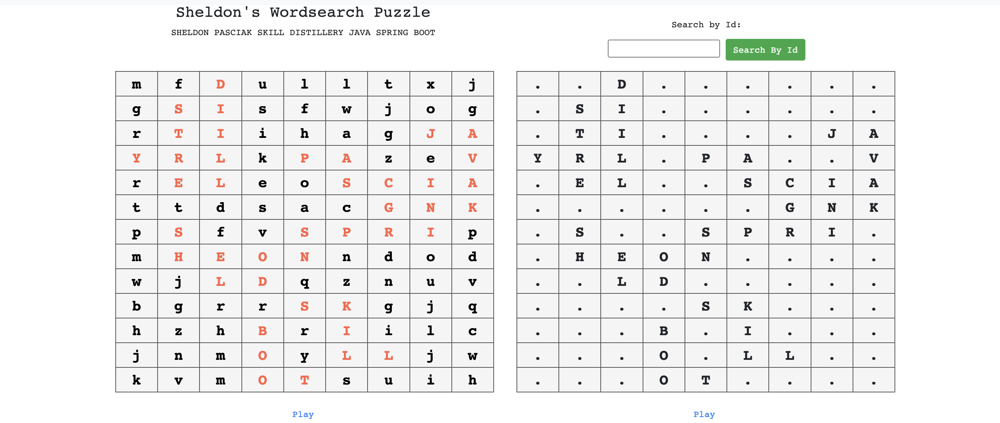
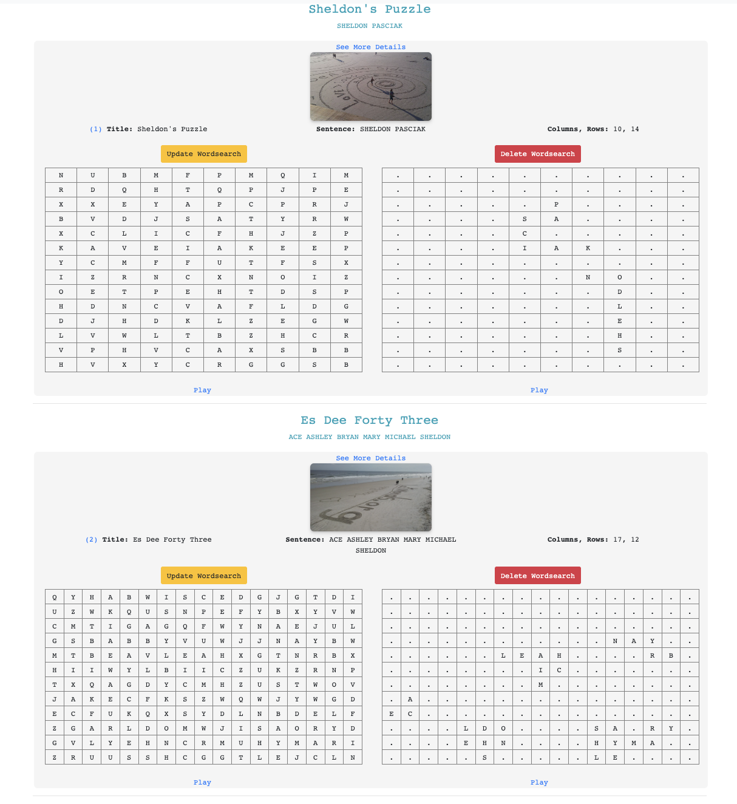
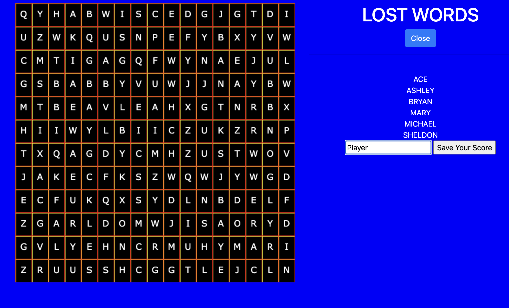

# JPACRUDProject

- Sheldon Pasciak
- April 15th, 2024
- Skill Distillery
- Full Stack JAVA


#### Description

- This is a full stack Spring Boot Project that implements the ability to Create, Read, Update and Delete records stored in a single table of a MySQL Database.

#### Technologies Used

    - JAVA
    - Eclipse
    - Git/GitHub
    - MySQL
    - Sublime Text Editor
    - Zsh
    - JPA
    - Spring Boot
    - HTML/CSS/JavaScript

#### Lessons Learned

    - Attention to detail, read and re-read requirements.
    - Make it work, then make it look good.
    - Focus on the requirements, then stretch the goals!
    - Be careful not to mix up cols/rows on edit!
    - Remember to update Tests according to seeded database.
    - How to use multipart upload for images.
    - How to use file system and webapp directory for public files.
    - Planning with a wiring diagram and needed models will be helpful.

<hr>

### The welcome page dynamically creates and renders a puzzle.



<hr>

### The database consists of only a single table.


<hr>

### The power of this app comes from weeks long development of a word-search hiding utility and related random/path based algorithms that I personally developed since the start of this cohort.


<hr>

### Home page route dynamically creates a puzzle to demo.


<hr>

### 'R'eading will generate a Table view that shows the list of puzzles.



<hr>

### 'R'eading also allows searching by Id.


<hr>

### 'U'pdating a puzzle will rehide words with image upload or hotlinking supported.


<hr>

### An HTML/JavaScript/Canvas index.html is included to interact with puzzle data.



<hr>

### Gradle and JUnit passing tests for Wordsearch entity.


<hr>

### Implemented for use with multiple hiding algorithms.


<hr>

### 'C'reating will allow you to add a record, also with image upload or hotlinking supported.


<hr>

### 'D'eleting will remove the record and show the deleted message and a refreshed list.


<hr>

#### Structure

```
JPACrudProject
├── 1.png
├── 2.png
├── 3.png
├── 4.png
├── 5.png
├── 6.png
├── 7.png
├── BootPuzzles
│   ├── HELP.md
│   ├── bin
│   ├── build.gradle
│   ├── gradle
│   │   └── wrapper
│   │       ├── gradle-wrapper.jar
│   │       └── gradle-wrapper.properties
│   ├── gradlew
│   ├── gradlew.bat
│   ├── settings.gradle
│   └── src
│       ├── main
│       │   ├── java
│       │   │   └── com
│       │   │       └── skilldistillery
│       │   │           └── puzzle
│       │   │               ├── BootPuzzlesApplication.java
│       │   │               ├── ServletInitializer.java
│       │   │               ├── controllers
│       │   │               │   └── WordsearchController.java
│       │   │               ├── data
│       │   │               │   ├── WordsearchDAO.java
│       │   │               │   └── WordsearchDAOJpaImpl.java
│       │   │               └── util
│       │   │                   ├── Point.java
│       │   │                   ├── Puzzle.java
│       │   │                   ├── PuzzleMatrix.java
│       │   │                   ├── PuzzlePiece.java
│       │   │                   └── PuzzleResult.java
│       │   ├── resources
│       │   │   ├── application.properties
│       │   │   ├── static
│       │   │   └── templates
│       │   └── webapp
│       │       ├── WEB-INF
│       │       │   ├── _head.jsp
│       │       │   ├── _nav.jsp
│       │       │   ├── _tail.jsp
│       │       │   ├── error.jsp
│       │       │   ├── home.jsp
│       │       │   ├── success.jsp
│       │       │   └── wordsearch
│       │       │       ├── _form.jsp
│       │       │       ├── add.jsp
│       │       │       ├── edit.jsp
│       │       │       ├── list.jsp
│       │       │       └── show.jsp
│       │       ├── favicon.png
│       │       ├── index.html
│       │       └── uploads
│       │           ├── 02e1c3bb-08ac-4335-a9d2-7649fbb7e707.png
│       │           ├── 11b3d680-4ea8-49be-ae35-db6634c799cc.png
│       │           ├── 17daea86-421f-495e-8902-f923dd189940.png
│       │           ├── 308d1b24-c975-438a-a43a-fc7c6440be53.png
│       │           ├── 3230b18f-0fb5-44b2-8255-66b22d867da5.png
│       │           ├── 43bd6fc1-64df-41a4-af2a-c9eedd912a7a.png
│       │           ├── 4685ab5a-e7fd-435a-9dbc-aac3d71f589e.png
│       │           ├── 5b17411a-d130-4981-80f9-b5321dfc4d57.png
│       │           ├── 72acd296-63a4-42a7-8e63-17c2b29943e3.png
│       │           ├── 81bbffb8-9c3d-4348-9175-b31ddfa94c69.png
│       │           ├── 86fb3e48-9aea-4f1a-8b6a-468ace053e28.png
│       │           ├── 8fe79e48-7b35-4e5e-afb3-4231b2db1a62.png
│       │           ├── 95e867bb-de63-4a1f-ac35-7b06bc4bc336.png
│       │           ├── b89e18fd-6bc4-4928-be13-47e86e1c6a0b.png
│       │           ├── cb717a77-899f-4836-8694-c6ee49d2ad50.png
│       │           ├── d0617b07-5858-4a89-91d9-c37e37ac3307.png
│       │           ├── dae671aa-e99d-499c-8e07-63005f3afad1.png
│       │           ├── default.png
│       │           ├── e436281d-b337-48df-82b4-9d5f6947ec2b.png
│       │           ├── ef99a372-b0a3-4dab-9785-546157d9a12e.png
│       │           ├── f03ad12d-ed8d-4f09-a596-9b1ed160ab33.png
│       │           ├── f25b9e76-37ad-432e-8bed-cb1da5d3a8b7.png
│       │           ├── f7913355-8c89-44ca-b2e5-bfef7abf7480.png
│       │           └── fde0c864-c673-4d59-bbaf-4afa34bfdc99.png
│       └── test
│           └── java
│               └── com
│                   └── skilldistillery
│                       └── puzzle
│                           └── BootPuzzlesApplicationTests.java
├── DB
│   ├── Puzzle.mwb
│   ├── Puzzle.sql
│   └── Puzzle.txt
├── JPAPuzzles
│   ├── bin
│   ├── build
│   ├── build.gradle
│   ├── gradle
│   │   ├── libs.versions.toml
│   │   └── wrapper
│   │       ├── gradle-wrapper.jar
│   │       └── gradle-wrapper.properties
│   ├── gradlew
│   ├── gradlew.bat
│   ├── settings.gradle
│   └── src
│       ├── main
│       │   ├── java
│       │   │   └── com
│       │   │       └── skilldistillery
│       │   │           └── puzzle
│       │   │               └── entities
│       │   │                   └── Wordsearch.java
│       │   └── resources
│       │       ├── META-INF
│       │       │   └── persistence.xml
│       │       └── log4j2.properties
│       └── test
│           ├── java
│           │   └── com
│           │       └── skilldistillery
│           │           └── puzzle
│           │               └── entities
│           │                   └── WordsearchTest.java
│           └── resources
│               └── log4j2.properties
└── README.md

115 directories, 116 files

```

### Contact me with any questions or reasonable, remote, part-time/full-time employment offers!

[About The Developer](https://github.com/pasciaks/)


